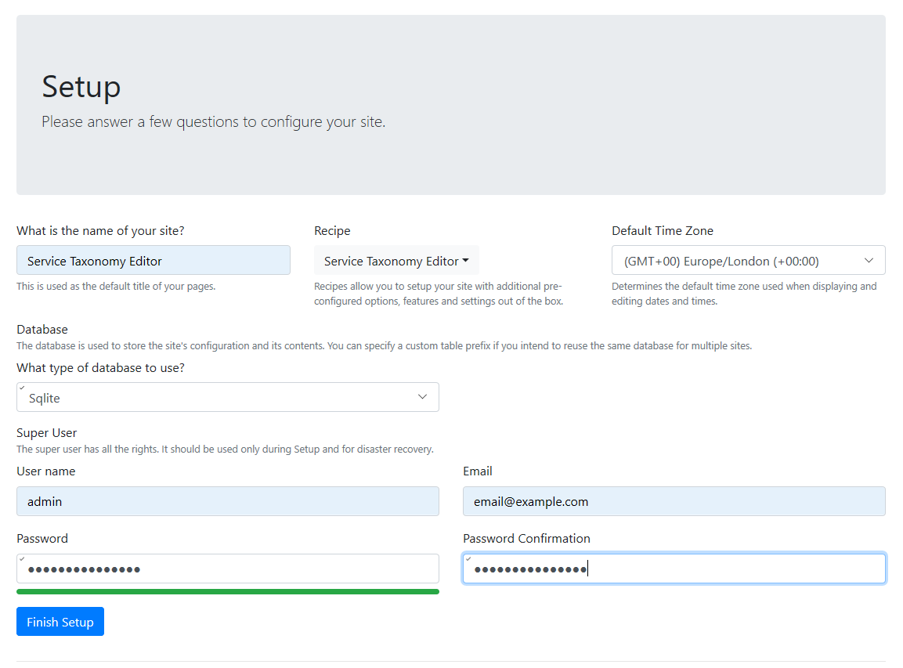

# Service Taxonomy Editor

## Developer Environment Setup

The solution is built using .NET Core 3.1, a CosmosDb database and a RDBMS database. You should be able to develop and run the solution on Windows, macOS or Linux.

### Set up CosmosDb Database

You can optionally choose to create a new CosmosDb database in Azure if you have access to do this or use Microsoft's CosmosDb emulator which can be downloaded [here](https://docs.microsoft.com/en-us/azure/cosmos-db/local-emulator?tabs=ssl-netstd21).

If you use the emulator ensure that you have started it before trying to launch your local STAX editor solution and that it has been configured correctly and in either case a database has been set up. This will be covered later in the configuration section.

### Create The (Orchard Core) Content Database

Setup a database for Orchard Core to store content. Any database with a .NET ADO provider is supported. For example, [setup a Azure SQL Database](https://docs.microsoft.com/en-us/azure/sql-database/sql-database-single-database-get-started?tabs=azure-portal).

Optionally, you can run a local Sqlite database with no initial setup necessary. This is the easiest option however there have been instances where errors have occurred in a MSSQL which do not happen with Sqlite, especially with regards to migrations and index initiallisation.

If you choose to use a SQL Server or Azure SQL database, ensure that the connection string enables multiple active result sets (MARS), by including `MultipleActiveResultSets=True`. If you go through the set-up process again (after deleting `App_Data`), you'll need to clear down the Azure SQL / SQL Server database, otherwise you'll get the error `invalid serial number for shell descriptor`.

### Create the Skills Framework Database

Restore a copy of the Skills Framework Database. Ideally this should be some version of a MSSQL database either hosted locally or in Azure as the database copy will be taken from there as .bacpac file.

You may get an error when trying to restore the bacpac file, in that event try running the following script in MSSQL against your master DB:

```
sp_configure 'contained database authentication', 1;
GO
RECONFIGURE;
GO
```

This is mainly a read only database from the view of the STAX editor but there is some potential for updates being made so a specific individual instance for your set up is best.

### Run And Configure Website

Clone the [GitHub repo](https://github.com/SkillsFundingAgency/dfc-servicetaxonomy-editor) and open the solution `DFC.ServiceTaxonomyEditor.sln` in your favourite .NET Core supporting IDE, such as [Visual Studio](https://visualstudio.microsoft.com/), [Visual Code](https://code.visualstudio.com/) or [Rider](https://www.jetbrains.com/rider/).

Set `DFC.ServiceTaxonomy.Editor` as the startup project.

Copy the `appsettings.Development_template.json` file in the editor project to `appsettings.Development.json`, inserting the appropriate values for the CosmosDb and Skills Framework Databse. (The template contains appropriate values if you've followed this readme.)
Note that you do not need to set up the "published" and "preview" containers in the CosmosDB in advance as these will be created when running the project for the first time if they are not there.
The EventGrid settings are not required for a local set up unless you wish to test something in this area, the PublishedEvents key can be set to false to disable this.

```
{
    "ConnectionStrings": {
        "SkillsFrameworkDB": "Server=(localdb)\\mssqllocaldb;Database=dfc-dev-onetskillsframework;Trusted_Connection=True;"
    },
    "ContentApiPrefix": "http://localhost:7071/api/execute",
    "PreviewContentApiPrefix": "http://localhost:7081/api/execute",
    "CosmosDb": {
        "endpoints": {
            "preview": {
                "ConnectionString": "AccountEndpoint=xxxx;AccountKey=xxxx==",
                "DatabaseName": "stax-db",
                "ContainerName": "preview"
            },
            "published": {
                "ConnectionString": "AccountEndpoint=xxxx;AccountKey=xxxx==",
                "DatabaseName": "stax-db",
                "ContainerName": "published"
            }
        }
    },
    "EventGrid": {
        "PublishEvents": "true",
        "Topics": [
            {
                "ContentType": "*",
                "TopicEndpoint": "<Insert your own topic endpoint here>",
                "AegSasKey": "<Insert your topic's key here>"
            }
        ]
    },
    "Pages": {
        "PublishedAppPrefix": "shell URI",
        "PreviewAppPrefix": "draft shell URI",
        "PublishedJobProfileAppPrefix": "shell URI",
        "PreviewJobProfileAppPrefix": "draft shell URI"
    },
    "JobProfiles": {
        "PublishedAppPrefix": "shell URI",
        "PreviewAppPrefix": "draft shell URI"
    },
    "GraphSyncSettings": {
        "MaxVisualiserNodeDepth": 10
    },
    "OrchardCore": {
        "OrchardCore_Media_Azure": {
            "ConnectionString": "",
            "ContainerName": "",
            "BasePath": "",
            "CreateContainer": false
        }
    },
    "AzureAdSettings": {
        "ClientId": "__ClientId__",
        "ClientSecret": "__ClientSecret__",
        "Authority": "__Authority__",
        "SubscriptionId": "__SubscriptionId__",
        "CdnProfileName": "__CdnProfileName__",
        "CdnEndpointName": "__CdnEndpointName__",
        "ResourceGroupName": "__ResourceGroupName__",
        "KeyVaultAddress": "__KeyVaultAddress__"
    },
    "ServiceBusSettings": {
        "ServiceBusConnectionString": "__ServiceBus-ConnectionString__",
        "ServiceBusTopicName": "__ServiceBus-TopicName__",
        "ServiceBusTopicNameForDraft": "__ServiceBus-TopicName-For-Draft__"
    },
    "DigitalAssetsCdn": "",
    "SlackMessagePublishingConfiguration": {
        "PublishToSlack": false
    }
}
```

Run or debug the `DFC.ServiceTaxonomy.Editor` project, which should launch the Setup page. Populate the page as follows, and click Finish Setup. (This runs the site using a local Sqlite database.)


*Note: this step will become unnecessary as the solution evolves.*

You should then be directed to the log in page. Enter the username and password you've just set up. If you have the memory of a goldfish, delete the DFC.ServiceTaxonomy.Editor\App_Data folder and start again.

### Import NCS Content

Content types and content can be imported via recipes. Several of these can be found in the DFC.ServiceTaxonomy.Editor/Recipes directory. Please refer to the ok[Content Import/Export](Documentation/Content.md) document for more information.

### Run Integration Tests

The integration tests are run as part of a release.

To run the integration tests locally, copy the `appsettings.Development_template.json` file in the `DFC.ServiceTaxonomy.IntegrationTests` folder to `appsettings.Development.json`, ensuring the settings file contains the correct config for the 'Published' graph.

### Set Up Event Grid

If enabled, the Stax Editor publishes events to a configured topic. A topic can be [setup in an Azure subscription](https://docs.microsoft.com/en-us/azure/event-grid/custom-event-quickstart-portal), or an [event grid emulator](https://github.com/Azure/eventgrid-emulator) ([unofficial](https://github.com/ravinsp/eventgrid-emulator)) can be used.

## Update Orchard Core Packages

The Orchard Core libraries are managed via the nuget manager and details on how to upgrade these are outlined [here](https://skillsfundingagency.atlassian.net/wiki/spaces/DFC/pages/3735748617/Orchard+Core+upgrade)
